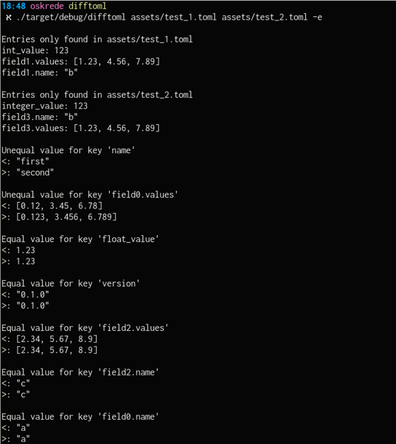

# difftoml

A small utility to display the difference between two toml files

## Features

- Display values that are unequal for equal keys
- Display keys only present in one of the input files
- Display values that are equal for equal keys (optional with `-e` flag)
- Colored output (optional with `-c` flag)
- Ignore keys in the comparison (optional with `-x keyname` option)

## Examples

